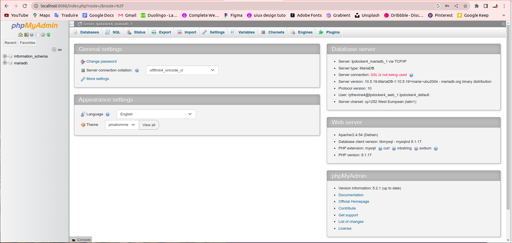

# Configuration-de-LAMP-avec-Docker-Compose

##---------------Documentation utilisée--------------##

> https://mariadb.com/kb/en/setting-up-a-lamp-stack-with-docker-compose/

> https://hub.docker.com/_/phpmyadmin

> https://hub.docker.com/_/mariadb

> https://hub.docker.com/_/mysql

##------------------Explications----------------------##

PMA_HOST: tpdocker4_mariadb_1
c'est l'adresse ou il doit aller chercher à quel serveur Mysql se connecter. Le PMA_HOSTS - définit une liste d'adresses/noms d'hôte séparés par des virgules des serveurs MySQL

##----------------Commandes utilisées------------------##

Je crée un dossier depuis mon home /home/lythevine:
**mkdir tpdocker4**

Je me place dans ce dossier:
**cd tpdocker4**

Je crée un fichier docker-compose.yml
**vim docker-compose.yml**

J’y entre toutes les données nécessaires:
**docker-compose up -d**

Je me connecte à ma base de données mariadb:
**docker exec -it aac954b55180 bash** 

Une fois connectée, je m'identifie avec mon utilisateur root:
**root@aac954b55180:/# mariadb -u lythevine4 -h 127.0.0.1 -p**

Je vais sur mon localhost:8088 et je connecte mon utilisateur avec les identifiants suivants:
**lythevine4**
**my-pwd4**

Et puis bammmmmmm…!!!

